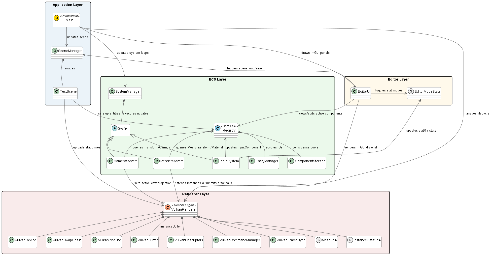

# Vulkan ECS Game Engine Prototype


A high-performance C++20 game engine prototype showcasing a **custom Entity-Component System (ECS)**, a modular **Vulkan rendering pipeline**, and an **interactive editor interface**. Designed with memory alignment and cache-locality in mind, it utilizes contiguous storage pools, structure-of-arrays optimization, and dynamic shader-instancing.

---

## Architecture Overview

The engine maintains a clean architectural separation between system layers. Bootstrap and lifecycle events are driven by a single-threaded main loop that delegates updates to independent systems and coordinates frame synchronization on the GPU.



For a comprehensive explanation of execution flow and frame sequence, see the [Architecture Guide](docs/architecture.md).

---

## Key Features

1.  **Custom ECS Backend**: Built from scratch using template-based queries, generational entity recycling, and dense component arrays. Incorporates the cache-friendly **Swap-Remove** pattern to keep memory allocations contiguous.
    *   *Read more: [ECS Subsystem Guide](docs/ecs_system.md)*
2.  **Modular Vulkan Wrapper**: Abstracted RAII handles encapsulating Vulkan instances, physical/logical devices, swapchains, buffers, and pipeline states, reducing API verbosity without sacrificing control.
    *   *Read more: [Vulkan Renderer Guide](docs/vulkan_renderer.md)*
3.  **Dynamic Instancing & Push Constants**: Draws grouped mesh batches in singular draws utilizing GPU registers via push constants to push per-instance model matrices and colors, minimizing driver draw call overhead.
4.  **Infinite World Grid**: Automatically generates a fading, infinite grid plane centered on the camera position via vertex-quad shader interpolation.
5.  **WYSIWYG Interactive Editor**: Integrated Dear ImGui overlay providing inline entity renaming, duplication, and property inspection (position, rotation, scale inputs, color picker, fov sliders, and grid spacing controls).
    *   *Read more: [Editor UI & Raycast Picking Guide](docs/editor_ui.md)*
6.  **3D Viewport Gizmos (ImGuizmo)**: Supports real-time translation, rotation, and scaling directly on selected entities in the 3D viewport, with automatic matrix decomposition back to ECS component transforms.
7.  **Raycast Viewport Picking**: Mathematical unprojection of 2D screen-space mouse coordinates to 3D world-space picking rays, resolving bounding sphere intersects to select entities directly in the viewport.
8.  **Scene Serialization**: Custom JSON scanning and loading routines to serialize/deserialize entity configurations, meshes, and material states into files.

---

## Detailed Subsystem Guides

To understand the engineering behind this prototype, explore the detailed documentation:

*   **[System Architecture](docs/architecture.md)**: Bootstrapping, game loop, frame lifecycle sequences, and layer boundaries.
*   **[Custom ECS Engine](docs/ecs_system.md)**: Registry, EntityManager, dense `ComponentStorage` vectors, swap-remove mechanics, compile-time views, and Structure of Arrays (SoA) memory optimizations.
*   **[Vulkan Graphics Pipeline](docs/vulkan_renderer.md)**: Custom API wrappers, double-buffered frame synchronization (fences/semaphores), pipeline assembly, instanced drawing batch loop, and push constant parameters.
*   **[Editor UI & Viewport Raycasting](docs/editor_ui.md)**: ImGui backend integration, viewport coordinate translation math (unprojecting NDC space), ray-sphere intersection solver, and JSON scene parser.

---

## Getting Started

### Hardware & System Requirements
*   **Operating System**: Windows 10/11
*   **Vulkan SDK**: Vulkan SDK 1.3+ installed on your system.
*   **Compiler**: C++20 compliant compiler (MSVC 2022, GCC 11+, or Clang 13+).
*   **Build System**: CMake 3.20+.

### Dependency Management
Dependencies are managed automatically through the CMake configuration:
*   **Vulkan SDK**: Located dynamically on the host system using the `find_package(Vulkan)` module (relies on the standard `VULKAN_SDK` environment variable set during installation).
*   **GLFW & GLM**: Fetched and configured automatically during the CMake configure step via `FetchContent`. No manual installation or directory setups are required.
*   **ImGui & ImGuizmo**: Bundled in `third_party/` and compiled automatically as static libraries.

### Setup & Compilation

1.  **Clone the Repository**:
    ```bash
    git clone https://github.com/tristepin222/Cpp-GameEngine-Prototype.git
    cd Cpp-GameEngine-Prototype
    ```
2.  **Compile Shaders**:
    Compile the shader source files under `game/assets/shaders/` into SPIR-V format using the Vulkan `glslc` compiler. You can run the following command block from the repository root:
    ```powershell
    # Compile Grid Shaders
    glslc game/assets/shaders/grid.vert -o game/build/shaders/grid.vert.spv
    glslc game/assets/shaders/grid.frag -o game/build/shaders/grid.frag.spv
    # Compile Unlit Shaders
    glslc game/assets/shaders/unlit.vert -o game/build/shaders/unlit.vert.spv
    glslc game/assets/shaders/unlit.frag -o game/build/shaders/unlit.frag.spv
    ```
3.  **Configure and Build with CMake**:
    Run the following commands from the repository root:
    ```bash
    # Configure the build (downloads dependencies and generates build files)
    cmake -B build -DCMAKE_BUILD_TYPE=Release

    # Compile the project
    cmake --build build --config Release
    ```
4.  **Run the Game**:
    The compiled binary and its copied assets/shaders are located in the `build` configuration directory (e.g., `build/Release/` or `build/Debug/` under Visual Studio, or directly in `build/` under Ninja/Make). Run it using:
    ```bash
    # For MSBuild / Visual Studio configurations:
    cd build/Release
    ./game.exe
    ```

> [!TIP]
> **Visual Studio / CLion Users**: You can open the repository root folder directly in your IDE (via **File -> Open -> Folder**), and the IDE will automatically detect the `CMakeLists.txt`, fetch dependencies, and configure the project.

---

## Controls Reference

When running the application, you can switch between editor controls and camera controls:

| Hotkey / Input | Mode | Description |
|---|---|---|
| **F Key** | All | Toggles between **Edit Mode** and **Fly Mode** |
| **W, A, S, D** | Fly Mode | Moves the camera Forward, Left, Backward, and Right |
| **Q, E** | Fly Mode | Moves the camera vertically Down and Up |
| **Mouse Drag** | Fly Mode | Rotates the camera view (look around) |
| **Mouse Hover** | Edit Mode | Interact with ImGui hierarchy, inspector panels, and debug window |
| **Mouse Left-Click** | Edit Mode | Click on 3D objects in the viewport to select them |
| **Gizmo Handles** | Edit Mode | Grab and drag the ImGuizmo axes to translate objects in real-time |
