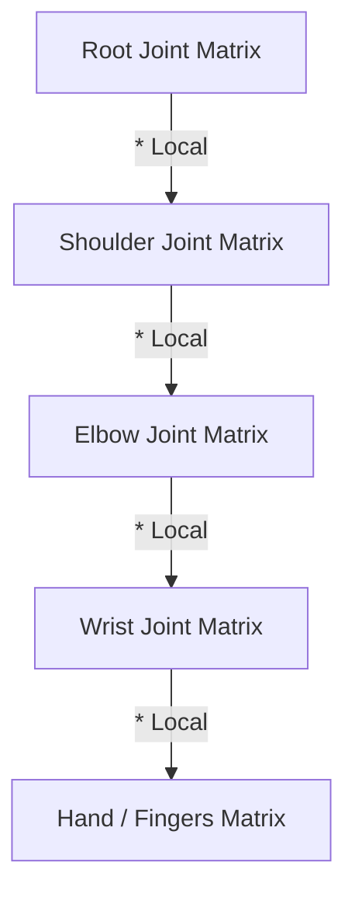

# Skeletal Animation & Skinning Subsystem

This document details the mathematical framework, ECS data layout, and Vulkan pipeline integrations designed for the **Skeletal Animation and Vertex Skinning Pipeline** (Stage 3).

---

## 1. Linear Blend Skinning (LBS) Math

To animate a 3D mesh using a virtual skeleton, vertices must deform dynamically according to the positions and orientations of their underlying joints (bones). The engine implements **Linear Blend Skinning (LBS)**.

### Mathematical Formulation
For each vertex \(v\), we compute its animated position \(v'\) as a weighted linear combination of its bone influences (up to 4 bones):

\[v' = \sum_{i=0}^{3} w_i \cdot \left( M_{\text{joint}(i)} \cdot B_{\text{joint}(i)}^{-1} \right) \cdot v\]

Where:
*   \(v\): The original vertex position in bind pose (mesh local space).
*   \(w_i\): The weight influence of bone \(i\) on this vertex, satisfying \(\sum w_i = 1.0\).
*   \(B_{\text{joint}(i)}^{-1}\): The **Inverse Bind Matrix** of the joint. It transforms the vertex from mesh space back into the joint's local space at the time the mesh was bound to the skeleton.
*   \(M_{\text{joint}(i)}\): The current **Global Transformation Matrix** of the joint in world space, calculated dynamically via Forward Kinematics.
*   \(\left( M \cdot B^{-1} \right)\): The final **Joint Offset Matrix** (or Skinning Matrix). It maps vertices from their default bind pose into their current animated pose.

---

## 2. Keyframe Interpolation

Animation clips consist of keyframe channels representing Translation, Rotation, and Scale over time. Since frames do not always align with keyframe timestamps, we interpolate values dynamically:

### Translation & Scale: Linear Interpolation (LERP)
For position and scale vectors, we perform a standard linear interpolation between keyframe \(A\) and keyframe \(B\):

\[P(t) = (1 - \alpha) \cdot P_A + \alpha \cdot P_B\]

Where \(\alpha = \frac{t - t_A}{t_B - t_A}\) is the normalized interpolation factor.

### Rotation: Spherical Linear Interpolation (SLERP)
To avoid gimbal lock and ensure smooth, constant-velocity rotations, joints store orientations as **quaternions** and interpolate using SLERP:

\[R(t) = \text{slerp}(R_A, R_B, \alpha) = \frac{\sin((1 - \alpha)\theta)}{\sin\theta} \cdot R_A + \frac{\sin(\alpha\theta)}{\sin\theta} \cdot R_B\]

Where \(\cos\theta = R_A \cdot R_B\) is the dot product of the quaternions.

---

## 3. Forward Kinematics (FK) Hierarchy

Joint positions are hierarchical: moving a shoulder bone must automatically translate the elbow, wrist, and fingers. 

### Local-to-Global Updates
For each frame, the **Animation System** resolves local joint transforms from interpolated keyframes:

\[T_{\text{local}} = T_{\text{translation}} \cdot R_{\text{rotation}} \cdot S_{\text{scale}}\]

We then traverse the skeleton tree from root to leaf to calculate the global transformation \(M_{\text{joint}}\) for each node recursively:

\[M_{\text{joint}} = M_{\text{parent}} \cdot T_{\text{local}}\]



---

## 4. Vulkan Shader Integration

Skinning is performed on the GPU inside the vertex shader to leverage hardware acceleration.

### Input Bindings
The vertex buffer is expanded to carry bone influence arrays:
*   `inBoneIDs`: `ivec4` containing the index offsets of the 4 influencing joints.
*   `inBoneWeights`: `vec4` containing the blending weights.

### Uniform Layout (Set 2)
The calculated offset matrices are bound as a descriptor set:
```glsl
layout(set = 2, binding = 0) uniform JointPalette {
    mat4 joints[128]; // Supports up to 128 bones per skinned mesh
} palette;
```

---

## 5. Roadmap: Inverse Kinematics (IK)

While Forward Kinematics (FK) moves joints from parent to child, **Inverse Kinematics (IK)** calculates joint angles backwards to reach a target destination (e.g., placing a foot exactly on uneven terrain).

We plan to implement two standard solvers:
1.  **Analytical Solver (2-Bone IK)**: Closed-form mathematical solution utilizing the Law of Cosines to solve simple joint chains like elbows and knees.
2.  **Iterative Solver (FABRIK / CCD)**: *Forward And Backward Reaching Inverse Kinematics*. An extremely fast, iterative algorithm that projects joint chains back and forth along straight lines until the target is reached, ideal for procedural spine bending or hand grabbing.
