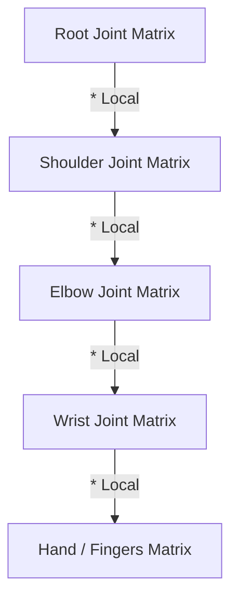

# Skeletal Animation & Skinning Subsystem

This document details the mathematical framework, ECS data layout, and Vulkan pipeline integrations designed for the **Skeletal Animation and Vertex Skinning Pipeline** (Stage 3).

---

## 1. Linear Blend Skinning (LBS) Math

To animate a 3D mesh using a virtual skeleton, vertices must deform dynamically according to the positions and orientations of their underlying joints (bones). The engine implements **Linear Blend Skinning (LBS)**.

### Mathematical Formulation
For each vertex \(v\), we compute its animated position \(v'\) as a weighted linear combination of its bone influences (up to 4 bones):

\[v' = \sum_{i=0}^{3} w_i \cdot \left( M_{\text{joint}(i)} \cdot B_{\text{joint}(i)}^{-1} \right) \cdot v\]

Where:
*   \(v\): The original vertex position in bind pose (mesh local space).
*   \(w_i\): The weight influence of bone \(i\) on this vertex, satisfying \(\sum w_i = 1.0\).
*   \(B_{\text{joint}(i)}^{-1}\): The **Inverse Bind Matrix** of the joint. It transforms the vertex from mesh space back into the joint's local space at the time the mesh was bound to the skeleton.
*   \(M_{\text{joint}(i)}\): The current **Global Transformation Matrix** of the joint in world space, calculated dynamically via Forward Kinematics.
*   \(\left( M \cdot B^{-1} \right)\): The final **Joint Offset Matrix** (or Skinning Matrix). It maps vertices from their default bind pose into their current animated pose.

---

## 2. Keyframe Interpolation

Animation clips consist of keyframe channels representing Translation, Rotation, and Scale over time. Since frames do not always align with keyframe timestamps, we interpolate values dynamically:

### Translation & Scale: Linear Interpolation (LERP)
For position and scale vectors, we perform a standard linear interpolation between keyframe \(A\) and keyframe \(B\):

\[P(t) = (1 - \alpha) \cdot P_A + \alpha \cdot P_B\]

Where \(\alpha = \frac{t - t_A}{t_B - t_A}\) is the normalized interpolation factor.

### Rotation: Spherical Linear Interpolation (SLERP)
To avoid gimbal lock and ensure smooth, constant-velocity rotations, joints store orientations as **quaternions** and interpolate using SLERP:

\[R(t) = \text{slerp}(R_A, R_B, \alpha) = \frac{\sin((1 - \alpha)\theta)}{\sin\theta} \cdot R_A + \frac{\sin(\alpha\theta)}{\sin\theta} \cdot R_B\]

Where \(\cos\theta = R_A \cdot R_B\) is the dot product of the quaternions.

---

## 3. Forward Kinematics (FK) Hierarchy

Joint positions are hierarchical: moving a shoulder bone must automatically translate the elbow, wrist, and fingers. 

### Local-to-Global Updates
For each frame, the **Animation System** resolves local joint transforms from interpolated keyframes:

\[T_{\text{local}} = T_{\text{translation}} \cdot R_{\text{rotation}} \cdot S_{\text{scale}}\]

We then traverse the skeleton tree from root to leaf to calculate the global transformation \(M_{\text{joint}}\) for each node recursively:

\[M_{\text{joint}} = M_{\text{parent}} \cdot T_{\text{local}}\]



---

## 4. Vulkan Shader Integration

Skinning is performed on the GPU inside the vertex shader to leverage hardware acceleration.

### Input Bindings
The vertex buffer is expanded to carry bone influence arrays:
*   `inBoneIDs`: `ivec4` containing the index offsets of the 4 influencing joints.
*   `inBoneWeights`: `vec4` containing the blending weights.

### Uniform Layout (Set 2)
The calculated offset matrices are bound as a descriptor set:
```glsl
layout(set = 2, binding = 0) uniform JointPalette {
    mat4 joints[256]; // Supports up to 256 bones per skinned mesh (16 KB limit compliant)
} palette;
```

---

## 5. Locomotion State Machines, 1D & 2D Blend Trees

To implement complex movement animations (like walking, running, and turning), the engine features a locomotion state machine and pose-blending system.

### Locomotion State Machine
Managed by the `AnimationControllerComponent`, the state machine tracks:
*   **States**: Defined animation clips with custom speed coefficients.
*   **Parameters**: Input floats (e.g. `velocityX`, `velocityY`, `speed`) evaluated to drive blend trees or trigger transitions.
*   **Transitions**: Directed state connections containing condition arrays (e.g., transition from `Idle` to `Movement` if `speed > 0.05`).
*   **Crossfading**: Smooth linear interpolation (LERP) of bone translations/scales and spherical linear interpolation (SLERP) of bone orientations between the outgoing and incoming states over a configurable duration (e.g., `0.25` seconds).

### 1D Blend Trees
States can point to 1D Blend Trees, which blend multiple keyframe clips together based on an input parameter. For example:
*   A `Movement` state contains clips for `Walk` (threshold `0.2`) and `Run` (threshold `0.8`).
*   If `speed` is `0.5`, the system samples keyframes from both clips at the same timeline offset and interpolates their joint transforms linearly using the blending weight \(\beta = \frac{0.5 - 0.2}{0.8 - 0.2} = 0.5\).

### 2D Freeform Cartesian Blend Trees
For complex locomotion systems (like directional strafing or backwards walking), states can use 2D Blend Trees driven by two parameters (such as `velocityX` and `velocityY` mapped to horizontal/vertical axes):
*   **Weight Calculation**: The system implements a **2D Freeform Cartesian (Gradient Band)** blending algorithm. For any input parameter position \(p\), the weight of each node \(i\) is computed relative to all neighboring nodes \(j \neq i\):
    \[w_i = \max\left(0, 1 - \max_{j \neq i} \frac{(p - p_i) \cdot (p_j - p_i)}{\|p_j - p_i\|^2}\right)\]
    The weights are then normalized to sum to \(1.0\).
*   **Multi-Pose Blending**: The system samples keyframes from all blend nodes with a non-zero weight and performs sequential hierarchical pose blending using their normalized weights.

### Automatic Player Locomotion Binding
During play mode, the `PlayerControllerSystem` maps the player's keyboard WASD inputs directly to the `AnimationControllerComponent` parameters:
*   Pressing **W** or **S** slides the target `velocityY` parameter smoothly towards `1.0` or `-1.0` (with **W** representing forward and **S** representing backward).
*   Pressing **D** or **A** slides the target `velocityX` parameter smoothly towards `1.0` or `-1.0` (strafing right/left).
*   The `speed` parameter is continuously set to the magnitude of the horizontal velocity vector: \(\sqrt{\text{velocityX}^2 + \text{velocityY}^2}\).
*   An exponential decay filter smooths inputs over time to guarantee fluid, seamless animation blending transitions in all directions.

---

## 6. Inverse Kinematics (IK) Solvers

While Forward Kinematics (FK) computes joint locations from parent to child, **Inverse Kinematics (IK)** computes joint rotations backwards to place an end-effector (e.g., foot, hand) exactly at a target position. The engine supports two solver types in the `IKSolverComponent`:

### 2-Bone Analytical Solver (Law of Cosines)
Used for simple limb joints (like thigh-shin-foot or shoulder-elbow-wrist). Given bone lengths \(a\) and \(b\), and distance to target \(c\):
1.  We calculate the interior angles of the triangle formed by the joint chain using the Law of Cosines:
    \[\cos\theta_{\text{knee}} = \frac{a^2 + b^2 - c^2}{2ab}\]
2.  We rotate the middle joint by \(\theta_{\text{knee}}\) relative to the hinge axis.
3.  We calculate the orientation of the start joint to align the end joint exactly with the target position.
4.  A world-space **pole vector** controls the bend direction of the hinge joint.

### Multi-Joint Iterative FABRIK Solver
The Forward And Backward Reaching Inverse Kinematics (FABRIK) solver resolves arbitrary joint chains (spines, tails, arms). It works in two passes:
1.  **Backward Pass**: Sets the tip joint position to the target, then pulls each preceding joint along the bone segment line to maintain constant bone lengths.
2.  **Forward Pass**: Sets the base joint back to its origin, and pushes each subsequent joint along the segment line.
3.  **Orientation Solver**: Once positions are solved, a sequential Forward Kinematics pass calculates the rotation quaternions between the original bone directions and the solved directions, propagating rotations down the chain. This preserves bone lengths and structural continuity.

---

## 7. Entity Transform Hierarchy & Skeletal Sharing

To support complex glTF models made of multiple submeshes (like a character with separate clothes or weapon parts), the ECS manages relationships using a parent-child transform hierarchy:

### Multi-Mesh Splitting
During model import, the engine splits multi-primitive glTF assets into separate child entities in the ECS parented to the first part root node using `HierarchyComponent`.

### Skeletal Sharing
To prevent duplicate bone math and GPU upload overhead:
*   Only the parent root entity holds the `SkeletonComponent` and `AnimatorComponent`.
*   During rendering, `RenderSystem` detects child entities. If they don't have a skeleton, it binds the parent root's joint matrices descriptor set (Set 2).
*   For skinned child meshes, the GPU vertex shader deforms vertices using this shared joint palette.
*   For rigid (non-skinned) child attachments, `RenderSystem::getWorldMatrix` searches for a bone matching the child's `parentBoneName` or `nodeName` in the parent's skeleton and multiplies the child's world matrix by the animated bone matrix.

### Recursive Deletion
When destroying a parent entity via the editor hierarchy panel, `Scene::deleteEntity` recursively gathers and deletes all child and grandchild descendants in the hierarchy tree to prevent memory leaks and orphaned entities in the registry.

---

## 8. Fast Binary Animation Pipeline (.anim)

To bypass slow glTF parses and support FBX animations, the engine implements a custom, high-speed binary animation format (`.anim`). The layout corresponds directly to our CPU memory structs, allowing direct contiguous block-reads.

### Binary File Layout (.anim)

1. **Header**:
   * Magic string: `b'ANIM'` (4 bytes)
   * Version: `1` (uint32)
2. **Skeleton Joints**:
   * `jointCount` (uint32)
   * For each joint:
     * `nameLength` (uint32) + `name` (UTF-8 char array)
     * `parentIndex` (int32)
     * `inverseBindMatrix` (16 floats, column-major)
     * `localTransform` (16 floats, column-major)
     * `bindTranslation` (3 floats)
     * `bindRotation` (4 floats: `x, y, z, w` matching GLM)
     * `bindScale` (3 floats)
3. **Clips & Keyframe Channels**:
   * `clipCount` (uint32)
   * For each clip:
     * `nameLength` (uint32) + `name` (UTF-8 char array)
     * `duration` (float)
     * `channelCount` (uint32)
     * For each channel:
       * `jointIndex` (int32)
       * `translationKeys`: `count` (uint32) + array of keyframes (`time` (float) + `value` (3 floats))
       * `rotationKeys`: `count` (uint32) + array of keyframes (`time` (float) + `value` (4 floats: `x, y, z, w` matching GLM))
       * `scaleKeys`: `count` (uint32) + array of keyframes (`time` (float) + `value` (3 floats))

---

## 9. Direct FBX Binary File Loading (ufbx)

Instead of relying on external pre-conversion scripts, the engine integrates the **[ufbx](https://github.com/ufbx/ufbx)** library inside **[ResourceManager.cpp](../engine/src/renderer/ResourceManager.cpp)**. This enables direct, native parsing of **FBX Binary** and ASCII files at runtime:

### Geometry Import
* **Triangulation**: Polygons and N-gons in FBX files are automatically triangulated using `ufbx_triangulate_face`.
* **Vertex Attribute Unrolling**: Resolves split-attribute mappings (where UVs or Normals are mapped per-index) and deduplicates them using a hash map before uploading to Vulkan.
* **Static Transforms**: Pre-transforms non-skinned vertices by their global node transform matrices.
* **Skin Weights & Indices**: Extracts up to 4 vertex bone influences from skin cluster weight maps and normalizes them.

### Animation Evaluation & Baking
* **Skeletal Joint Mapping**: Collects the FBX node hierarchy tree and matches bone indices. If a bone is referenced in a skin cluster, its bind pose is configured using the cluster's `geometry_to_bone` matrix; otherwise, it defaults to the inverse of the node's global bind pose.
* **Animation Baking**: Rather than manually parsing complex, layered FBX animation curves (Bezier, Hermite, Linear, Step), the engine queries `ufbx_evaluate_transform` at a constant 30 FPS rate across each anim stack. This automatically bakes the correct interpolated local translations, rotations, and scales.

---

## 10. Drag-and-Drop Editor Mapping & Append Loading

To streamline state machine authoring, the editor supports direct drag-and-drop mapping of `.anim` and `.fbx` files onto animation states and blend tree nodes:
*   **Non-destructive Appending**: The `ResourceManager` supports an `append` loading flag. Instead of clearing the animator's cached clips when loading a file, it appends or overwrites the newly loaded clips, allowing multiple separate animation files to be loaded into the same animator.
*   **DND Asset Binding**: Dragging any `.anim` or `.fbx` asset file from the content browser and dropping it onto the **Animation Clip** slot of a single clip state or the **Clip Name** slot of a blend tree node immediately triggers the non-destructive importer and binds the loaded clip to that slot.

---

## Case Study & Engineering Post-Mortem

To read about the real-world bugs, rendering constraints, and architectural challenges solved during the development of these systems, please refer to:
*   **[Skinned Animation Case Study (Post-Mortem)](file:///f:/GitHub/Cpp-GameEngine-Prototype/docs/skinned_animation_postmortem.md)**
