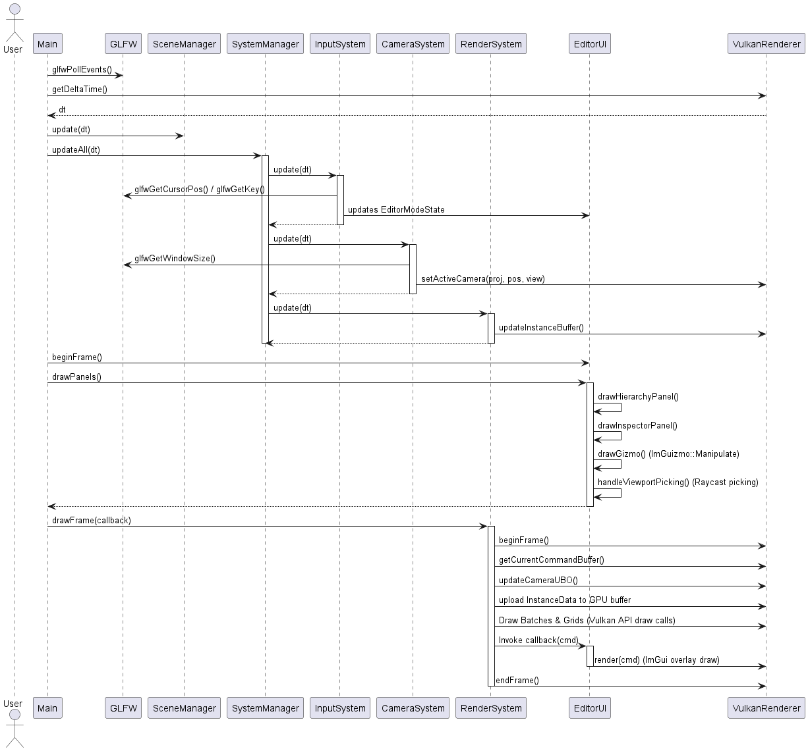

# Engine Architecture

This document describes the high-level architecture and system layout of the C++ Game Engine Prototype.

## System Design Overview

The engine is structured as a modular desktop application in C++20, utilizing GLFW for OS windowing/events and Vulkan for rendering. The application maintains a clear separation between core systems, resource managers, systems logic, editor GUI, and the application level.

### Architectural Layers

1.  **Application Layer (`main.cpp`, `SceneManager`, `Scene`)**: 
    The bootstrap/entry point. It initializes GLFW, creates the window, instantiates the ECS Registry, binds systems, and sets up scene states.
2.  **Entity-Component System (ECS) Layer (`Registry`, `EntityManager`, `ComponentStorage`)**:
    A lightweight, custom ECS backend that manages entities, component allocations, and subscriptions. Component data is stored contiguously in memory pools (`ComponentStorage`) to maintain maximum cache locality.
3.  **Systems Layer (`System`, `SystemManager`)**:
    Encapsulates logical behaviours (rendering, user input, camera movement) by querying active components via ECS "Views" and executing updates once per frame.
4.  **Editor Layer (`EditorUI`, `EditorModeState`)**:
    An interactive debug panel and WYSIWYG editor powered by ImGui and ImGuizmo. Enables real-time entity manipulation, scene hierarchy inspection, component modification, and scene load/save options.
5.  **Renderer Layer (`VulkanRenderer`, `core/` abstractions)**:
    Wraps Vulkan objects (devices, swapchains, buffers, descriptor pools, command managers, pipelines) in custom, safe RAII classes. Manages double-buffering, data upload to VRAM, and draw command recording.

---

## Frame Lifecycle & Execution Flow

The engine operates on a single-threaded game loop inside [main.cpp](file:///f:/GitHub/Cpp-GameEngine-Prototype/game/src/main.cpp). The lifecycle of a single frame comprises polling OS events, updating active scenes, updating ECS systems, drawing the UI panels, and submitting Vulkan command buffers for drawing.

The sequence below illustrates the frame execution flow:

### Detailed Loop Phases

*   **OS Event Polling**: Calls `glfwPollEvents()` to update mouse/keyboard and window resizing data.
*   **Scene Update**: Updates active scene logic via `SceneManager::update(dt)`.
*   **ECS Systems Update**: Walks through the registered list of systems in the `SystemManager` and calls `update(dt)`:
    *   **Input System**: Reads mouse delta and WSADQE keys. When `Fly Mode` is active, it hides the cursor and updates the `InputComponent`'s look/move vectors. When `Edit Mode` is active, it releases the mouse cursor back to ImGui.
    *   **Camera System**: Reads the `InputComponent` and updates the active camera's view-projection matrices. Computes movement vectors in 3D space, applying mouse sensitivity and speeds, then propagates updates to the `VulkanRenderer`.
    *   **Render System (Update)**: Compiles active entity model matrices, colors, materials, and mesh configurations into a CPU cache (`InstanceDataSoA`) to prepare for instanced draw calls.
*   **Editor Panel Draw**: Records ImGui layouts, inspects properties of the selected entity, captures viewport mouse clicks for Raycast picking, and applies 3D transformations via ImGuizmo.
*   **Render Draw Frame**: The `RenderSystem::drawFrame` coordinates Vulkan-specific recording:
    1.  Acquires an image from the swapchain.
    2.  Pushes camera uniform buffer data (View-Projection matrix).
    3.  Uploads instance data (model matrices, colors) to the GPU dynamic instance buffer.
    4.  Draws grid elements and model batches using push constants.
    5.  Executes the overlay callback, triggering ImGui Vulkan backend render commands.
    6.  Submits the recorded command buffer to the graphics queue and presents the rendered swapchain image.
