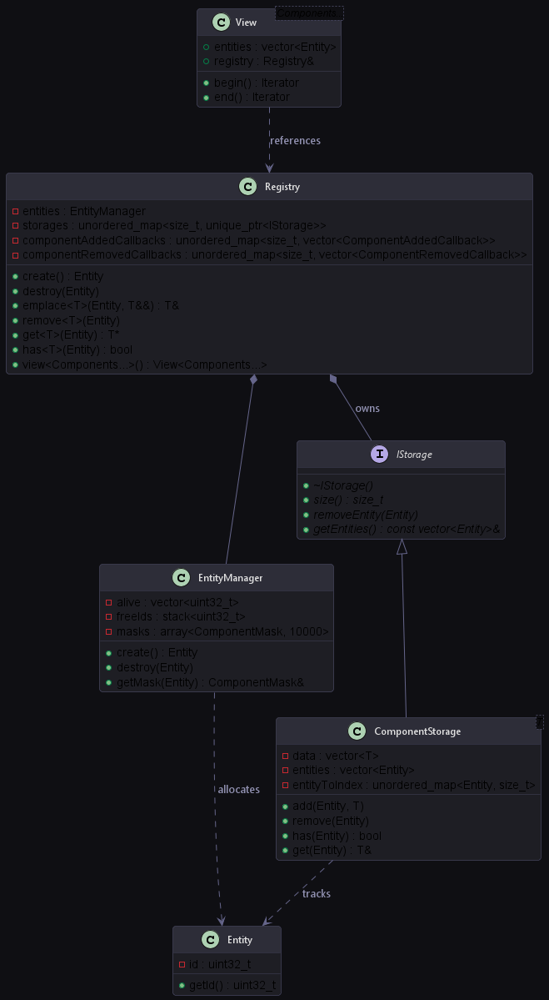

# Custom Entity-Component System (ECS)

This document provides a technical deep-dive into the engine's custom, header-only Entity-Component System (ECS). The ECS is designed from scratch to prioritize cache locality, fast component lookups, generational entity recycling, and compile-time template queries.



---

## Entity Allocation & Recycling

The [Entity](../engine/include/ecs/Entity.hpp) class is a simple 32-bit wrapper around an integer identifier (`uint32_t`). To prevent fragmentation and maintain strict bounds, entity lifetime is governed by the [EntityManager](../engine/include/ecs/EntityManager.hpp).

*   **Max Entities**: The system caps the active entity list to `10,000` (defined by `MAX_ENTITIES`).
*   **Recycling Queue**: Free entity IDs are stored in a `std::stack<uint32_t>`. When an entity is destroyed, its ID is recycled back to the stack, making it available for subsequent allocations.
*   **Component Mask**: The `EntityManager` allocates an array of 64-bit masks (`std::bitset<64> ComponentMask`). Each bit represents whether an entity owns a specific component type.

---

## ComponentStorage & The Swap-Remove Pattern

Components are pure data structures with no behavior. To avoid CPU cache misses, components are stored contiguously in memory inside [ComponentStorage.hpp](../engine/include/ecs/ComponentStorage.hpp).

```cpp
template<typename T>
class ComponentStorage : public IStorage {
private:
    std::vector<T> data;                              // Contiguous component data
    std::vector<Entity> entities;                     // Parallel vector tracking entity ownership
    std::unordered_map<Entity, size_t> entityToIndex; // O(1) Index lookup map
};
```

### The Swap-Remove Mechanics

When a component is removed from an entity, removing from a middle index in a `std::vector` would shift all subsequent elements, which is an \(O(N)\) cost. 

To achieve \(O(1)\) deletion while maintaining a dense, contiguous array, the storage implements the **Swap-Remove** (or swap-and-pop) pattern:
1.  Locate the index of the component to delete via the `entityToIndex` map.
2.  Swap this component with the *last* component in the vector.
3.  Swap the corresponding entry in the parallel `entities` vector.
4.  Update the swapped entity's index in the `entityToIndex` map to its new position.
5.  Call `.pop_back()` on both vectors to remove the target component in \(O(1)\).

This keeps data perfectly aligned, contiguous, and packed tight in RAM, ensuring maximum CPU cache efficiency during serial updates.

---

## Event Subscriptions

The [Registry](../engine/include/ecs/Registry.hpp) allows systems to subscribe to events when components are added or removed:
```cpp
using ComponentAddedCallback = std::function<void(Entity)>;
using ComponentRemovedCallback = std::function<void(Entity)>;
```
This is heavily utilized in [RenderSystem.hpp](../engine/include/ecs/systems/RenderSystem.hpp) to automatically manage the rendering queues. When a `Mesh`, `Transform`, or `Material` component is added to an entity, the system caches it. When any of these components are removed, the entity is evicted from the renderer cache:
```cpp
registry.subscribeToAdded<Mesh>([this](Entity e) { checkAndAdd(e); });
registry.subscribeToRemoved<Mesh>([this](Entity e) { removeEntity(e); });
```

---

## Compile-Time Multi-Component Views

The most powerful feature of the custom ECS is the `Registry::view<Components...>()` query. It extracts a view of entities possessing the specified subset of components.

### Optimization: Smallest Pool Heuristic

To search for entities with components `A`, `B`, and `C`, iterating through all entities in the engine would be highly inefficient. 

Instead, the `Registry` queries the size of each component pool and picks the **smallest storage pool** as the driver. It then iterates through that pool and filters out entities that do not contain the remaining components:

```cpp
template<typename First, typename Second, typename... Rest>
IStorage* getSmallestStorage() {
    IStorage* a = getStorage<First>();
    IStorage* b = getSmallestStorage<Second, Rest...>();
    if (!a) return b;
    if (!b) return a;
    return (a->size() < b->size()) ? a : b;
}
```

### Iterator Structured Binding Support

The view provides standard C++ Iterators, allowing systems to use simple range-based for loops with structured bindings:
```cpp
for (auto [entity, cam, transform, input] : registry.view<Camera, Transform, InputComponent>()) {
    // Process components directly
}
```

---

## Structure of Arrays (SoA) Optimizations

To push performance even further for bulk operations (like updating transforms or uploading mesh buffers to the GPU), the engine implements a **Structure of Arrays (SoA)** memory layout in the `soa/` directory.

Unlike Array of Structures (AoS), where each entity holds a packed struct of positions, rotations, scales:
```cpp
// AoS Layout (Standard Transform Component)
struct Transform {
    glm::vec3 position;
    glm::vec3 rotation;
    glm::vec3 scale;
};
std::vector<Transform> transforms;
```

The SoA layout decomposes these fields into separate vectors inside [TransformSoA.hpp](../engine/include/soa/TransformSoA.hpp) and [MeshSoA.hpp](../engine/include/soa/MeshSoA.hpp):
```cpp
// SoA Layout
struct TransformSoA {
    std::vector<glm::vec3> positions;
    std::vector<glm::vec3> rotations;
    std::vector<glm::vec3> scales;
};
```

### CPU Cache Line Visual Comparison

```text
Array of Structures (AoS) - Cache Line Pollution:
+-----------------------------------------------------------+
| Entity 0 (Pos) | Entity 0 (Color) | Entity 0 (Name) | ... |
+-----------------------------------------------------------+
(When updating positions, the CPU cache line is polluted with unused Colors and Names, wasting memory bandwidth).

Structure of Arrays (SoA) - Cache Friendly:
+-----------------------------------------------------------+
| Position 0     | Position 1       | Position 2      | ... |
+-----------------------------------------------------------+
(Cache lines contain ONLY position data, guaranteeing a 100% cache hit rate during bulk updates).
```

### Benefits of SoA in the Engine
1.  **VRAM Upload Efficiency**: The `MeshSoA` stores vertex and index buffers contiguously, making bulk VRAM uploads via staging buffers highly streamable.
2.  **Vectorization (SIMD)**: Separate arrays allow modern compilers to auto-vectorize mathematics (like updating positions, physics, or computing bounding matrices), since elements are packed contiguously in cache lines with zero stride.
3.  **Dynamic Allocations**: The GPU instancing system reads from CPU-side `InstanceDataSoA` models, colors, and material IDs to batch upload GPU instance arrays in a single `vkCmdDrawIndexed` queue preparation loop.

---

## Example Usage Code (Registry & Views)

Below is an example showing how to create entities, attach components, and query them using views:

```cpp
// 1. Create Registry
Registry registry;

// 2. Spawn Entity
Entity player = registry.create();

// 3. Attach Components
registry.emplace<Transform>(player, glm::vec3(0.0f, 0.0f, 0.0f));
registry.emplace<Mesh>(player, PrimitiveFactory::createCube());
registry.emplace<Name>(player, "Player");

// 4. Query entities with Transform and Mesh using compile-time Views
for (auto [entity, transform, mesh] : registry.view<Transform, Mesh>()) {
    // This loop automatically drives from the smallest component storage pool
    // and operates directly on contiguous CPU memory pools.
    transform.position.y += 1.0f * dt;
}
```

