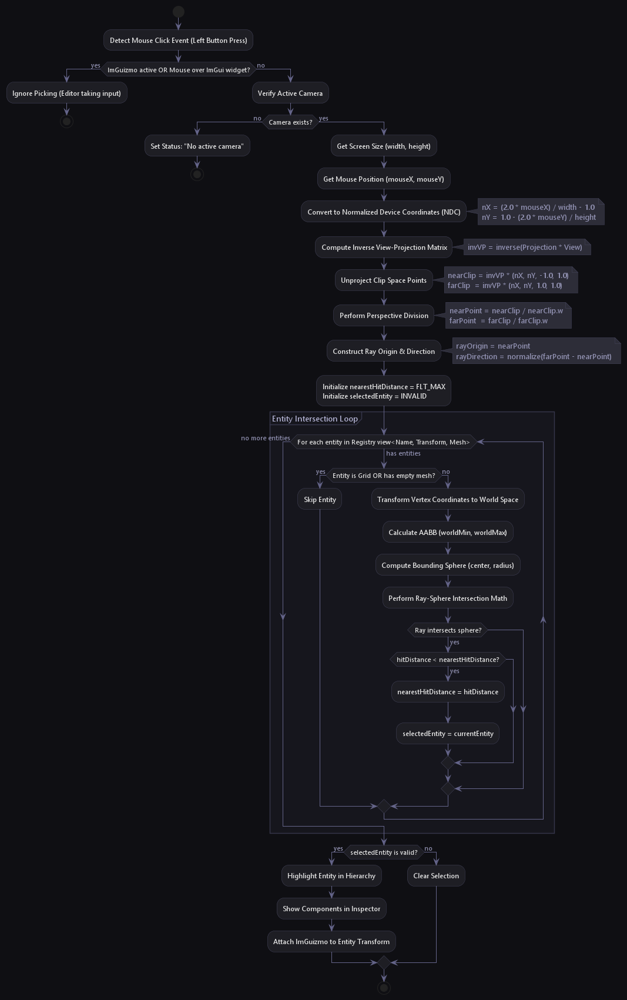

# Editor UI & Raycast Picking

This document describes the design of the engine's interactive editor UI, built with ImGui and ImGuizmo, and details the mathematical implementation of viewport raycast picking and scene serialization.



---

## ImGui & ImGuizmo Integration

The editor frontend is managed by [EditorUI.cpp](../game/src/editor/EditorUI.cpp). It integrates Dear ImGui with Vulkan and GLFW backends.

*   **Initialization**: The system allocates a custom descriptor pool (`VkDescriptorPool`) for ImGui font textures, initializes window events hooks (`ImGui_ImplGlfw_InitForVulkan`), and registers the Vulkan rendering callbacks (`ImGui_ImplVulkan_Init`).
*   **Fly Mode vs Edit Mode**: The user can toggle between modes by pressing the **F key**:
    *   **Edit Mode**: Releases the cursor, allowing the user to select entities, drag gizmos, and click UI inputs.
    *   **Fly Mode**: Disables the cursor (`GLFW_CURSOR_DISABLED`), redirecting raw mouse movement and keyboard inputs to camera traversal.

---

## Editor Panels & Controls

The UI is divided into dockable panels providing full control over the active scene:

1.  **Hierarchy Panel**: Lists all entities in the active registry. Clicking an entity selects it. Provides actions to:
    *   Create new primitive entities (Cube, Triangle, Quad).
    *   Create new camera and grid entities.
    *   Duplicate existing entities (copies attributes and shifts positions).
    *   Rename entities using inline text buffers.
    *   Delete entities from the active registry.
2.  **Inspector Panel**: Exposes components attached to the selected entity for real-time modification:
    *   **Transform Editor**: Direct floating-point fields and slider controls to adjust 3D Translation, Rotation, and Scale.
    *   **Material Editor**: Color picker to adjust RGB tinting.
    *   **Camera Editor**: Slides to modify Field of View (FOV), speed settings, and mouse sensitivity.
    *   **Grid Editor**: Configures infinite grid line spacing, spacing colors, and fade-off distance bounds.
3.  **Scene Controls Panel**: Contains controls to serialise/deserialise the active scene JSON file.
4.  **Debug Console Panel**: Displays frame rate metrics (FPS), picking data (ray origin, ray direction, click ray intersects), and active state descriptions.

---

## Viewport Gizmos (ImGuizmo)

To manipulate 3D entities in world space, the editor integrates **ImGuizmo**. 

*   **Projection Alignment**: Translates camera projection and view matrix coordinates to screen coordinate overlays.
*   **Vulkan Clip Adjust**: Corrects Vulkan's inverted Y-axis clip coordinate calculations:
    ```cpp
    glm::mat4 proj = renderer.getActiveCameraProjection();
    proj[1][1] *= -1.0f; // Invert projection coordinate for Vulkan space alignment
    ```
*   **Decomposition**: When the user drags a gizmo, the result is outputted as a combined transformation matrix (`glm::mat4 model`). The engine decomposes this matrix back to position, rotation, and scale components to update the entity's `Transform` component:
    ```cpp
    ImGuizmo::DecomposeMatrixToComponents(&model[0][0], translation, rotation, scale);
    ```

---

## Viewport Raycast Picking Math

When the user clicks in the 3D viewport, the screen-space click coordinate must be cast as a 3D ray into the scene to identify clicked objects.

### Step 1: Normalized Device Coordinates (NDC)
Screens coordinates `(mouseX, mouseY)` in pixels are converted to NDC space $[-1, 1]$:
\[nX = \frac{2.0 \cdot \text{mouseX}}{\text{width}} - 1.0\]
\[nY = 1.0 - \frac{2.0 \cdot \text{mouseY}}{\text{height}}\]

### Step 2: Unprojecting Clip Space Points
We compute the inverse View-Projection matrix (`invVP`) and multiply it by the NDC coordinates at the near clip plane (\(z = -1.0\)) and far clip plane (\(z = 1.0\)):
\[\text{nearClip} = \text{invVP} \cdot \begin{pmatrix} nX \\ nY \\ -1.0 \\ 1.0 \end{pmatrix}, \quad \text{farClip} = \text{invVP} \cdot \begin{pmatrix} nX \\ nY \\ 1.0 \\ 1.0 \end{pmatrix}\]

### Step 3: Perspective Division
Divide clip coordinates by their projection scale component `w` to yield world-space coordinates:
\[\text{nearPoint} = \frac{\text{nearClip}}{\text{nearClip.w}}, \quad \text{farPoint} = \frac{\text{farClip}}{\text{farClip.w}}\]

### Step 4: Construct Ray
The ray's starting point is the near point, and its direction is the normalized vector pointing from near to far:
\[\text{rayOrigin} = \text{nearPoint}\]
\[\text{rayDirection} = \text{normalize}(\text{farPoint} - \text{nearPoint})\]

### Step 5: Ray-Sphere Intersection Test
For each entity in the registry view:
1.  Transforms vertex coordinates using its model matrix to calculate its world-space Axis-Aligned Bounding Box (AABB).
2.  Computes a bounding sphere from AABB:
    *   $\text{center} = \frac{\text{worldMin} + \text{worldMax}}{2}$
    *   $\text{radius} = \text{length}(\text{worldMax} - \text{center})$
3.  Performs ray-sphere intersection by solving the quadratic equation:
    \[t^2 \cdot (\mathbf{d} \cdot \mathbf{d}) + 2t \cdot (\mathbf{oc} \cdot \mathbf{d}) + (\mathbf{oc} \cdot \mathbf{oc}) - r^2 = 0\]
    where $\mathbf{oc} = \text{rayOrigin} - \text{center}$ and $\mathbf{d} = \text{rayDirection}$.
4.  If the discriminant is positive, the ray hits the sphere. The entity with the smallest intersection distance $t$ is selected.

---

## Scene Serialization

The engine implements a lightweight custom JSON parser and generator inside [TestScene.cpp](../game/src/scenes/TestScene.cpp) to save and load scenes:

### Saving Scene File
*   Iterates through all entities matching the `<Name, Transform>` view.
*   Writes out a JSON representation listing:
    *   `name` (string)
    *   `position`, `rotation`, `scale` (JSON Float arrays)
    *   Component specific fields: `entityType` ("Primitive" / "Grid" / "Camera"), `primitive` ("Triangle" / "Cube" / "Quad"), `color` vector, `fov`, `gridSpacing`.

### Loading Scene File
*   Reads the scene file into a string buffer.
*   Extracts entity objects using string scanning helper functions.
*   Destroys all active entities to clear the scene.
*   Re-instantiates entities and reconstructs components based on the parsed JSON key-value pairs.
