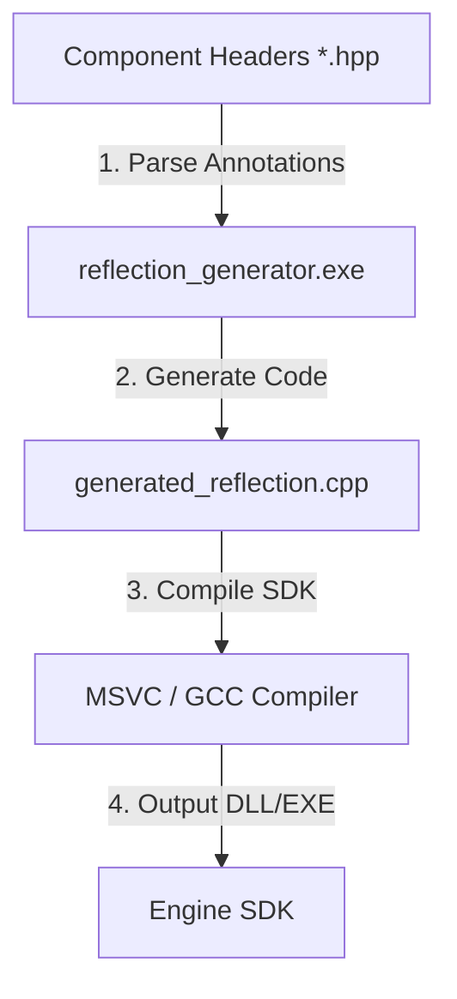
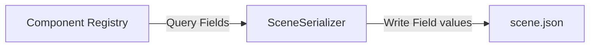

# Static Reflection & Serialization Subsystem

This document details the design, pipeline, and integration of the engine's **Static Reflection System**. Built to overcome the lack of native runtime reflection in C++, this subsystem enables automatic component serialization to JSON and dynamic ImGui inspector rendering without manual field mappings.

---

## 1. Why Static Reflection?

In standard C++, there is no built-in way to query a class's member variables at runtime. Traditional solutions introduce undesirable trade-offs:
*   **Manual Mapping**: Manually writing serialization and UI functions for every component is highly error-prone and leads to severe boilerplate bloat.
*   **Runtime RTTI**: Standard C++ Run-Time Type Information is slow, limited, and does not expose member variables or structures.
*   **Dynamic Heap Reflection**: Storing field data in dynamic runtime maps incurs high heap-allocation and memory-indirection overhead.

Our engine implements a **Compile-Time Static Reflection** model:
1.  Components are marked with macro annotations.
2.  A custom build tool parses these annotations.
3.  The tool generates C++ metadata files containing type descriptors and compile-time member offsets (`offsetof`).
4.  The engine queries this static metadata at runtime with zero heap allocations or performance penalties.

---

## 2. Annotation & Syntax

To register a component and its fields with the reflection engine, developers use the following annotations inside component headers:

```cpp
struct TransformComponent {
    REFLECT_BODY(TransformComponent)

    PROPERTY(glm::vec3, position)
    PROPERTY(glm::vec3, rotation)
    PROPERTY(glm::vec3, scale)
};
```

### Key Macros
*   `REFLECT_BODY(Type)`: Declares type introspection helpers inside the struct (such as its registered name string).
*   `PROPERTY(Type, Name)`: Registers the member field with its type and identifier name, enabling the parser to record its size, offset, and type info.

---

## 3. Code Generation Pipeline (`reflection_generator`)

The compilation pipeline separates reflection code generation from core compilation:



### Execution Flow
During the build step, the custom `reflection_generator` executable parses the component header files:
1.  **Header Scanner**: Scans designated include paths for `PROPERTY` declarations.
2.  **Metadata Baking**: Resolves field offsets (`offsetof(Struct, Field)`) and basic type descriptors (e.g., `float`, `int`, `vec3`, `std::string`, `bool`).
3.  **Code Output**: Generates `generated_reflection.cpp`, containing static registration arrays:

```cpp
// Example of generated metadata code
void registerTransforms() {
    ComponentRegistry::registerComponent<TransformComponent>("TransformComponent");
    ComponentRegistry::registerProperty("TransformComponent", "position", &TransformComponent::position);
    ComponentRegistry::registerProperty("TransformComponent", "rotation", &TransformComponent::rotation);
    ComponentRegistry::registerProperty("TransformComponent", "scale", &TransformComponent::scale);
}
```

---

## 4. Scene Serialization Integration

The `SceneSerializer` leverages reflection metadata to save and load scenes to JSON automatically. When saving a scene, instead of hardcoding serialization logic for every component, the serializer queries the reflection engine:



### Automatic Field Serialization
For every entity in the registry:
1.  The serializer loops over all registered component types.
2.  If the entity possesses the component, the serializer retrieves its reflection descriptor list.
3.  For each field descriptor, it reads the value directly from the component memory block using the computed field offset.
4.  The value is converted to a JSON key-value pair based on its registered type (e.g. string, float, or 3-element float array for `glm::vec3`).

During scene loading, this process is reversed: the serializer instantiates the component in the ECS registry and writes the loaded JSON values into the component's memory offsets.

---

## 5. Editor UI Property Drawer

The interactive **Inspector Panel** in the editor uses the same reflection descriptors to render field controls dynamically.

### Dynamic Rendering
When an entity is selected in the editor:
1.  The `EditorSystem` queries the component types attached to the entity.
2.  For each component, it queries the reflection registry for its member properties.
3.  It loops over the properties and draws corresponding ImGui controls based on the field type:
    *   **`float` / `int`**: Renders `ImGui::DragFloat` or `ImGui::DragInt` inputs.
    *   **`glm::vec3`**: Renders three aligned input fields (X, Y, Z) labeled with color-coded tags.
    *   **`bool`**: Renders a checkbox (`ImGui::Checkbox`).
    *   **`std::string`**: Renders a text input box (`ImGui::InputText`).
    *   **`glm::vec4` (Color)**: Automatically renders an interactive color picker box (`ImGui::ColorEdit4`).

This guarantees that any new component or field added by game developers is immediately editable in the viewport inspector without writing a single line of editor UI code.
