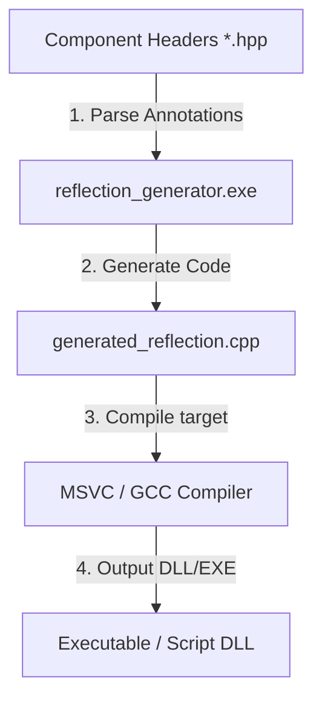
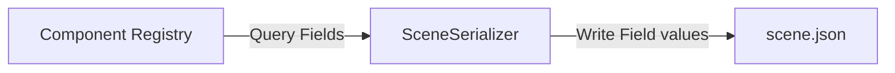

# Static Reflection & Serialization Subsystem

This document details the design, pipeline, and integration of the engine's **Static Reflection System**. Built to overcome the lack of native runtime reflection in C++, this subsystem enables automatic component serialization to JSON and dynamic ImGui inspector rendering without manual field mappings.

---

## 1. Why Static Reflection?

In standard C++, there is no built-in way to query a class's member variables at runtime. Traditional solutions introduce undesirable trade-offs:
*   **Manual Mapping**: Manually writing serialization and UI functions for every component is highly error-prone and leads to severe boilerplate bloat.
*   **Runtime RTTI**: Standard C++ Run-Time Type Information is slow, limited, and does not expose member variables or structures.
*   **Dynamic Heap Reflection**: Storing field data in dynamic runtime maps incurs high heap-allocation and memory-indirection overhead.

Our engine implements a **Compile-Time Static Reflection** model:
1.  Components are marked with macro annotations.
2.  A custom build tool parses these annotations.
3.  The tool generates C++ metadata files containing type descriptors and compile-time member offsets (`offsetof`).
4.  The engine queries this static metadata at runtime with zero heap allocations or performance penalties.

---

## 2. Annotation & Syntax

To register a component and its fields with the reflection engine, developers place comments and registration macros inside component headers:

```cpp
// [ReflectClass]
struct ENGINE_API TransformComponent {
    // [ReflectField]
    glm::vec3 position{ 0.0f };
    // [ReflectField]
    glm::vec3 rotation{ 0.0f };
    // [ReflectField]
    glm::vec3 scale{ 1.0f };
};

REGISTER_COMPONENT(TransformComponent, "General");
```

### Key Annotations
*   `// [ReflectClass]`: Marks a class/struct to be scanned by the reflection generator.
*   `// [ReflectField]`: Marks the member variable immediately following the comment to be parsed. Supported types include `float`/`double`, `int`/`uint32_t`/`size_t`, `bool`, `glm::vec2`/`vec3`/`vec4`, `std::string`, and custom engine types like `Entity` or `RigidBodyType`.
*   `REGISTER_COMPONENT(Type, MenuPath)`: A macro to register the component's runtime metadata and assign its category/display name for the editor UI (e.g., `"Physics/Rigid Body"`). It also sets up standard ECS lifecycle callbacks (`add`, `has`, `remove`, `get`) using templates.

---

## 3. Code Generation Pipeline (`reflection_generator`)

The compilation pipeline separates reflection code generation from core compilation:


```mermaid
graph TD
    Source[Component Headers *.hpp] -->|1. Parse Annotations| Parser[reflection_generator.exe]
    Parser -->|2. Generate Code| GenCpp[generated_reflection.cpp]
    GenCpp -->|3. Compile target| Compiler[MSVC / GCC Compiler]
    Compiler -->|4. Output DLL/EXE| Target[Executable / Script DLL]
```

### Execution Flow
During the pre-build or custom-build step, the custom `reflection_generator` executable parses the component header files:
1.  **Header Scanner**: Scans designated include paths for `// [ReflectClass]` and `// [ReflectField]` annotations.
2.  **Metadata Baking**: Resolves field offsets (`offsetof(Struct, Field)`) and basic type descriptors.
3.  **Code Output**: Generates `generated_reflection.cpp`, containing static registration code:

```cpp
// Example of generated metadata code
void registerEngineReflection() {
    {
        Engine::ComponentReflection refl;
        refl.name = "TransformComponent";
        refl.category = "General";
        refl.displayName = "Transform Component";
        refl.fields = {
            { "position", Engine::FieldType::Vec3, offsetof(TransformComponent, position) },
            { "rotation", Engine::FieldType::Vec3, offsetof(TransformComponent, rotation) },
            { "scale", Engine::FieldType::Vec3, offsetof(TransformComponent, scale) }
        };
        refl.add = [](Registry& reg, Entity e) { reg.emplace<TransformComponent>(e, TransformComponent{}); };
        refl.has = [](Registry& reg, Entity e) { return reg.has<TransformComponent>(e); };
        refl.remove = [](Registry& reg, Entity e) { reg.remove<TransformComponent>(e); };
        refl.get = [](Registry& reg, Entity e) { return static_cast<void*>(reg.get<TransformComponent>(e)); };
        Engine::ComponentReflectionRegistry::getInstance().registerComponent(refl);
    }
}
```

---

## 4. Scene Serialization Integration

The `SceneSerializer` leverages reflection metadata to save and load scenes to JSON automatically. When saving a scene, instead of hardcoding serialization logic for every component, the serializer queries the reflection engine:


```mermaid
graph LR
    Registry[Component Registry] -->|Query Fields| Serializer[SceneSerializer]
    Serializer -->|Write Field values| JSON[scene.json]
```

### Automatic Field Serialization
For every entity in the registry:
1.  The serializer loops over all registered component types.
2.  If the entity possesses the component, the serializer retrieves its reflection descriptor list.
3.  For each field descriptor, it reads the value directly from the component memory block using the computed field offset.
4.  The value is converted to a JSON key-value pair based on its registered type (e.g. string, float, or 3-element float array for `glm::vec3`).

During scene loading, this process is reversed: the serializer instantiates the component in the ECS registry and writes the loaded JSON values into the component's memory offsets.

---

## 5. Editor UI Property Drawer

The interactive **Inspector Panel** in the editor uses the same reflection descriptors to render field controls dynamically.

### Dynamic Rendering
When an entity is selected in the editor:
1.  The `EditorSystem` queries the component types attached to the entity.
2.  For each component, it queries the reflection registry for its member properties.
3.  It loops over the properties and draws corresponding ImGui controls based on the field type:
    *   **`float` / `int`**: Renders `ImGui::DragFloat` or `ImGui::DragInt` inputs.
    *   **`glm::vec3`**: Renders three aligned input fields (X, Y, Z) labeled with color-coded tags.
    *   **`bool`**: Renders a checkbox (`ImGui::Checkbox`).
    *   **`std::string`**: Renders a text input box (`ImGui::InputText`).
    *   **`glm::vec4` (Color)**: Automatically renders an interactive color picker box (`ImGui::ColorEdit4`).

This guarantees that any new component or field added by game developers is immediately editable in the viewport inspector without writing a single line of editor UI code.
