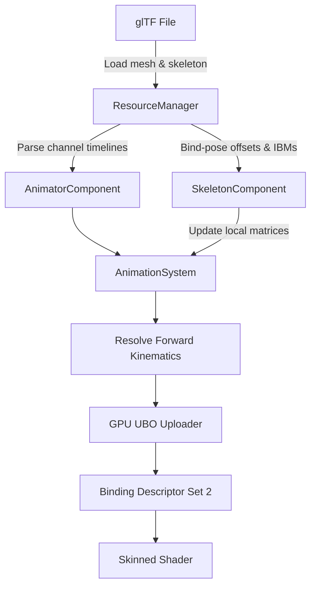

# Case Study: Engineering a Skinned Animation System in a Custom Vulkan Engine

This post-mortem details the technical hurdles, architectural bugs, and rendering limitations encountered during the development of a GPU-skinned animation pipeline in a custom C++ game engine, and how they were resolved.

---

## The Architecture
The animation pipeline follows standard game engine conventions, divided between CPU hierarchy tick logic and GPU vertex skinning:



---

## Challenges & Resolutions

### 1. The glTF Buffer Loader Crash (cgltf_load_buffers Failure)
*   **The Issue**: Rigged models failed to load, outputting the error `Error: failed to load gLTF buffers: assets/scene.gltf`. 
*   **The Cause**: The glTF parser (`cgltf`) requires buffer paths to be resolved relative to the parent directory of the `.gltf` file. In our path handler, passing the raw filename directly to `cgltf_load_buffers` caused the parser to look for binary buffers (`.bin`) in the engine's working directory instead of the subfolder where the `.gltf` file resided.
*   **The Fix**: Modified the resource manager to extract the directory path from the target glTF path and pass this base directory to the cgltf loader, allowing relative resource resolution.

---

### 2. Mesh Collapsing (The Empty Channel Overwrite)
*   **The Issue**: On loading a model, the skeletal bones collapsed into their parents, crumpling the humanoid character mesh down to a squashed pile on the floor.
*   **The Cause**: glTF loop animations optimize storage by only exporting keyframe channels for bones that actively move during a clip. If a bone is only rotated, its translation track is omitted. 
    Our animation sampler previously evaluated empty tracks as `[0, 0, 0]` translation and `[1, 1, 1]` scale. Because the keyframe tick loop processed these channels sequentially, the empty tracks overwrote the bone's default bind offsets, collapsing the joints.
*   **The Fix**:
    1.  At load time, we decompose each joint's default `localTransform` matrix using `glm::decompose` and store the default `bindTranslation`, `bindRotation`, and `bindScale` components.
    2.  At runtime, the keyframe interpolator falls back to these default bind-pose TRS values if an animation channel's keyframe vector is empty.

---

### 3. Vulkan UBO Range Constraints (The Crumpled Rig)
*   **The Issue**: The model loaded successfully in its T-pose (without rigs), but importing it with a skeleton caused vertices to warp and stretch into massive spikes pointing towards the center of the world.
*   **The Cause**: 
    The vertex shader declared a static uniform block size for bone matrices:
    ```glsl
    layout(set = 2, binding = 0) uniform JointPalette {
        mat4 joints[128];
    } palette;
    ```
    This expects a UBO buffer of exactly `128 * sizeof(mat4) = 8192` bytes. However, our C++ code allocated UBO buffers dynamically based on the model's joint count (e.g. `30 * 64 = 1920` bytes). Binding a Vulkan buffer range smaller than the block declared in the shader is a layout mismatch, causing the driver to read out-of-bounds or zero-out joint inputs, deforming the mesh vertices.
*   **The Fix**: Updated the buffer creation logic to always allocate and map a constant block size of exactly 128 joint matrices (8 KB), initializing any unused elements to identity transforms.

---

### 4. Highly Detailed Rig Support (189-Bone Overflow)
*   **The Issue**: When importing a highly detailed character model, the bottom half rendered correctly, but the upper limbs, hands, and fingers crumpled and spiked.
*   **The Cause**: The character rig had **189 bones**. Because our C++ and shader arrays were capped at 128 joints, all vertices mapped to joint indices $\ge 128$ accessed memory out-of-bounds in Vulkan, defaulting to zero matrices.
*   **The Fix**: Expanded the maximum joint limit to **256 joints** in both `skinned.vert` and C++. 256 matrices require exactly 16 KB, which complies with the minimum maximum uniform buffer size guaranteed by the Vulkan specification on all graphics hardware.

---

### 5. Static Animation Playback (Overlapping Joint Channels)
*   **The Issue**: The animation timeline progressed in the editor, and joint matrices updated, but the model remained frozen in a static T-pose.
*   **The Cause**: In glTF, translation, rotation, and scale tracks are exported as separate channels targeting the same joint node. 
    Our parser loaded channels in a flat list. If one bone was targeted by three channels (translation, rotation, and scale), they were updated sequentially. When the scale channel ran (which had 0 keyframes), it read the default bind rotation and overwrote the animated rotation from the previous channel, freezing the bone.
*   **The Fix**: Refactored the loader in `ResourceManager::loadSkeletonAndAnimations` to use a temporary hash map grouped by `jointIndex`. All incoming glTF channels targeting the same joint index are grouped into a single consolidated `AnimationChannel` structure containing translation, rotation, and scale keyframe tracks. The system now resolves all TRS modifications concurrently and writes to the joint's transform matrix once per frame.

---

## Key Takeaways for Portfolio
*   **Vulkan Layout Compliance**: Shader uniform arrays must have matching buffer allocations. Dynamically sizing UBOs below what the shader expects causes driver-level memory mismatches.
*   **glTF Channel De-duplication**: Animation tracks targeting the same scene node must be grouped and updated atomically rather than processed sequentially.
*   **Matrix Decomposition**: Storing discrete bind-pose TRS parameters is essential for blending, keyframe fallbacks, and maintaining joint relationships when animation channels are sparse.
