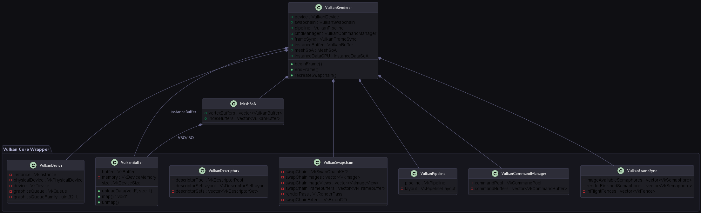

# Vulkan Rendering Engine

This document details the graphics architecture of the Vulkan Renderer. The renderer is designed to abstract raw Vulkan API complexity into clean, RAII C++ wrapper classes while preserving performance, supporting instanced drawing, and utilizing modern techniques like Push Constants.



---

## Vulkan Abstraction Layer

Vulkan requires explicit declaration of resources, layouts, synchronization, and hardware access. The engine implements a set of object-oriented C++ classes under `engine/src/core/` to safely encapsulate Vulkan handles:

*   **[VulkanContext](../engine/src/core/VulkanContext.hpp)**: Stores instance-wide structures, validation layer callbacks, and physical device enumerations.
*   **[VulkanDevice](../engine/src/core/VulkanDevice.hpp)**: Handles hardware physical devices selection (prioritizing discrete GPUs) and logical device creation. Configures queue families for graphics, presentation, and transfers.
*   **[VulkanSwapchain](../engine/src/core/VulkanSwapChain.hpp)**: Manages screen resolution changes, double/triple buffering image chains, render pass configurations, swapchain image views, and framebuffers.
*   **[VulkanPipeline](../engine/src/core/VulkanPipeline.hpp)**: Coordinates shader layout state bindings, viewport/scissor setup, depth/stencil tests, color blending, rasterization, and multi-sampling configurations.
*   **[VulkanBuffer](../engine/src/core/VulkanBuffer.hpp)**: Encapsulates `VkBuffer` allocation and `VkDeviceMemory` binding. Supports staging allocations, GPU-local transfer operations, and persistent host mapping.
*   **[VulkanDescriptors](../engine/src/core/VulkanDescriptors.hpp)**: Standardizes descriptor layouts, bindings, pools, and set allocations for camera matrices and global uniforms.
*   **[VulkanCommandManager](../engine/src/core/VulkanCommandManager.hpp)**: Creates command pools and records frame buffer command sequences. Supports one-time command buffer execution for staging buffers uploads.
*   **[VulkanFrameSync](../engine/src/core/VulkanFrameSync.hpp)**: Holds CPU-GPU synchronization elements, preventing race conditions via fences and swapchain image-acquisition semaphores.

---

## Double-Buffered Frame Synchronization

To prevent the CPU from submitting draw commands faster than the GPU can process them (which would lead to visual artifacts or memory exhaust), the engine coordinates double-buffering using [VulkanFrameSync.hpp](../engine/src/core/VulkanFrameSync.hpp):

```cpp
struct VulkanFrameSync {
    std::vector<VkSemaphore> imageAvailableSemaphores; // GPU-GPU: image is ready for rendering
    std::vector<VkSemaphore> renderFinishedSemaphores; // GPU-GPU: rendering completed, ready to present
    std::vector<VkFence>     inFlightFences;           // CPU-GPU: CPU waits for frame to finish on GPU
};
```

### The Render Loop Sync Protocol
1.  **Wait for Frame Fence**: Before starting a new frame, the CPU waits on the `inFlightFence` of the current frame index (`vkWaitForFences`). This guarantees the GPU is finished executing the command buffer we're about to record into.
2.  **Acquire Next Image**: Request the next image from the swapchain using `vkAcquireNextImageKHR`, passing the `imageAvailableSemaphore`.
3.  **Reset Fence**: Reset the fence (`vkResetFences`) to lock the current frame buffer slot.
4.  **Submit Command Buffer**: Submit the recorded commands to the graphics queue (`vkQueueSubmit`).
    *   **Wait Stage**: Configured to wait on the `imageAvailableSemaphore` at the `VK_PIPELINE_STAGE_COLOR_ATTACHMENT_OUTPUT_BIT` stage.
    *   **Signal Stage**: Signals the `renderFinishedSemaphore` when drawing is completed.
    *   **Fence Trigger**: Passes the `inFlightFence` to automatically trigger when the GPU has finished execution.
5.  **Present Image**: Request presentation (`vkQueuePresentKHR`), waiting on the `renderFinishedSemaphore` to ensure rendering has finished.

### Trade-Off: Double vs Triple Buffering
* **Double Buffering (Engine Choice)**: Limits active frames in flight to 2. This keeps input latency low (the time between user input and screen update is at most 2 frames) and reduces VRAM allocation for swapchain buffers.
* **Triple Buffering**: Allows a 3rd frame to start processing on the CPU while the GPU draws the 2nd and displays the 1st. While this hides framerate micro-stutters, it introduces an extra frame of input lag and requires additional buffer allocation memory pools.

---

## Resource Lifetimes & RAII Destruction Sequence

Vulkan has strict rules regarding object lifetimes: objects cannot be destroyed while the GPU is still executing commands that reference them. Additionally, Vulkan handles must be destroyed in the **reverse order of their creation**.

Our RAII wrappers coordinates resource disposal via an explicit cleanup sequence inside [VulkanRenderer::cleanup()](../engine/src/VulkanRenderer.cpp):

1. **GPU Wait**: Wait for the GPU to complete all running queue operations using `vkDeviceWaitIdle(device)`.
2. **Editor UI Disposal**: Call `ImGui_ImplVulkan_Shutdown()` and `ImGui_ImplGlfw_Shutdown()` to clean up GUI font allocations and render states.
3. **Pipeline Cleanup**: Destroy pipelines (`VkPipeline`) and layouts (`VkPipelineLayout`).
4. **Descriptor Sets**: Clear pools (`VkDescriptorPool`) and set layouts (`VkDescriptorSetLayout`).
5. **Framebuffers & RenderPass**: Destroy framebuffers and the main render pass.
6. **Swapchain**: Destroy the swapchain (`VkSwapchainKHR`) and its image views.
7. **Buffer Deallocation**: Free vertex, index, and instancing dynamic buffers (`vkDestroyBuffer` and `vkFreeMemory`).
8. **Sync Primitives**: Destroy fences and semaphores (`vkDestroyFence`, `vkDestroySemaphore`).
9. **Logical Device & Instance**: Destroy the logical `VkDevice` handle, and finally the `VkInstance` instance.


---

## Shader & Graphics Pipeline Compilation

Shaders are written in GLSL and compiled to binary SPIR-V bytecode. The build process uses the `glslc` compiler to build:
*   `unlit.vert` / `unlit.frag` -> `unlit.vert.spv` / `unlit.frag.spv` (handles standard mesh drawing)
*   `grid.vert` / `grid.frag` -> `grid.vert.spv` / `grid.frag.spv` (handles infinite grid rendering)

The [PipelineBuilder](../engine/src/core/PipelineBuilder.hpp) dynamically builds the graphics pipelines. It links vertex input bindings, rasterization settings (cull modes, depth test enabling), color blending, and shader modules into a single `VkPipeline` state.

---

## Instanced Drawing & Push Constants

For maximum performance, the renderer avoids calling `vkCmdDraw` for every individual entity. Instead, it groups draw calls by **Mesh + Material combination** inside [RenderSystem.hpp](../engine/include/ecs/systems/RenderSystem.hpp).

### Per-Instance Data via Push Constants

Rather than storing model matrices in costly dynamic uniform buffers, the engine utilizes **Push Constants**. Push Constants reside in high-speed registers on the GPU, allowing instant access with zero memory overhead.

The push constant structure is defined as:
```cpp
struct PushConstants {
    glm::mat4 model;  // Entity transformation matrix
    glm::vec4 color;  // Base tint color
};
```

### The Batch Drawing Loop
1.  **Group Entities**: The `RenderSystem` aggregates active entities into batches of identical `Mesh*` and `Material*` keys.
2.  **Bind Pipeline & Descriptors**: Binds the material's pipeline and descriptor sets (which contain camera projection-view uniform buffer data).
3.  **Bind Vertex/Index Buffers**: Binds the mesh vertex buffer (VBO) and index buffer (IBO) once.
4.  **Draw Instances**: Iterates through the batch. For each instance:
    *   Fills the `PushConstants` struct with the instance's model matrix and color.
    *   Pushes data using `vkCmdPushConstants`.
    *   Calls `vkCmdDrawIndexed` with an instance count of 1.

By using push constants and batching vertex/index buffer bindings, the engine reduces CPU driver overhead and minimizes state changes.

---

## Infinite Grid Rendering

The engine implements a beautiful infinite grid component. It is drawn dynamically inside `drawGrids()` without requiring a complex vertex buffer:
1.  Binds the grid pipeline.
2.  Passes grid parameters (camera position, grid color, spacing, fade size) via a specialized grid push constant block.
3.  Calls `vkCmdDraw(cmd, 6, 1, 0, 0)` with 6 vertices.
4.  The `grid.vert` shader generates a screen-aligned quad on the fly. The `grid.frag` shader calculates grid lines in world space and applies a fading effect based on distance from the camera position, creating a smooth grid backdrop.
